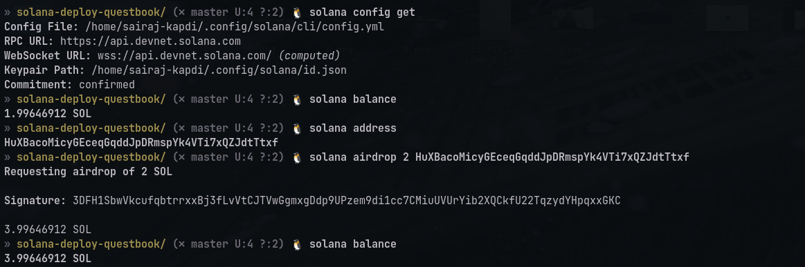

# Quest 2 ([Create your personal cryptocurrency using Solana CLI]("https://openquest.xyz/quest/create_crypto_with_solana_cli"))

###### Checking config and balance

###### Creating a token

###### Creating an account that can hold balance of token

###### Minting tokens

###### Disable minting (Making it non-fungible)

###### Burning tokens

[Link to token on devnet](https://explorer.solana.com/address/72WVA8b7Jc53ra1zLKPHw44MrSgf4pSA597ZPiUAUCXb?cluster=devnet)
