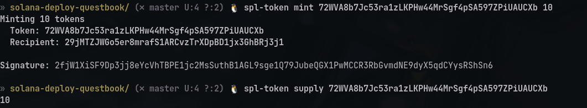

# Quest 2 (Create your personal cryptocurrency using Solana CLI)

## Checking config and balance
```console
solana config get # to get your config
solana balance # to get SOL balance
solana address # to get public key for your account created using solana-keygen
solana airdrop ${AMOUNT} $(solana address) # to get airdrop, specify AMOUNT
```


## Creating a token
```console
spl-token create-token # creates a new token and prints address
```


## Creating an account that can hold balance of token
```console
spl-token create-account # creates an account to hold your new token balance
```


## Minting tokens
```console
spl-token mint ${TOKEN_ADDRESS} ${NUMBER_OF_TOKENS} # mints tokens
```


## Disable minting (Making it non-fungible)
```console
spl-token authorize ${TOKEN_ADDRESS} mint --disable
```


## Burning tokens
```console
spl-token burn ${TOKEN_ACCOUNT_ADDRESS} ${NUMBER_OF_TOKENS_TO_BURN}
```


[Link to token on devnet](https://explorer.solana.com/address/72WVA8b7Jc53ra1zLKPHw44MrSgf4pSA597ZPiUAUCXb?cluster=devnet)
[Quest Link](https://openquest.xyz/quest/create_crypto_with_solana_cli)