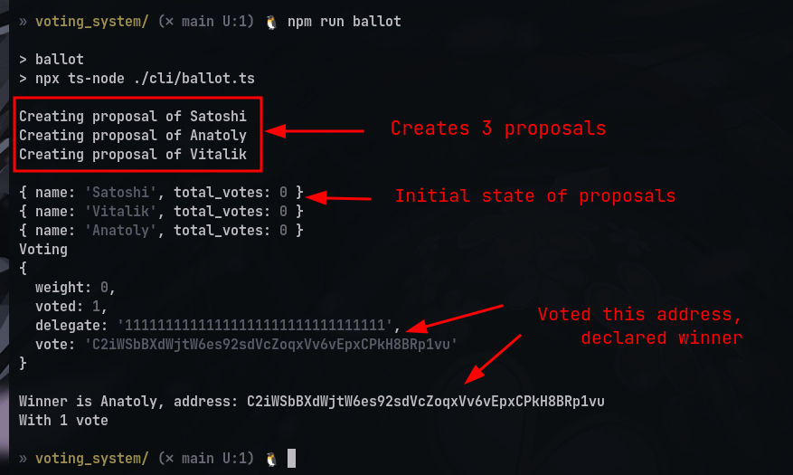

# Exercise (Simple voting program on Solana)

## Install dependencies and run test script

```console
npm install
node index.js
```


Note: The above screenshot dosent include the part where a voter can delegate a vote, but it is implemented in the Program <br>
Note: Not much error handling done in the client script. script will run only once per deployment.
