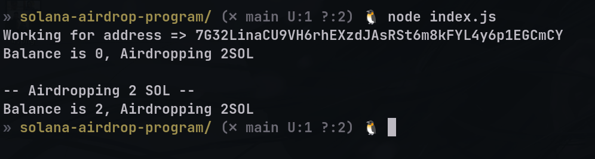

# Quest 1 (Create a roulette game in Solana)

## Install dependencies and run script

```console
npm install
node index.js
```



[Quest Link](https://openquest.xyz/quest/create-an-airdrop-program-with-solana-web3.js)

