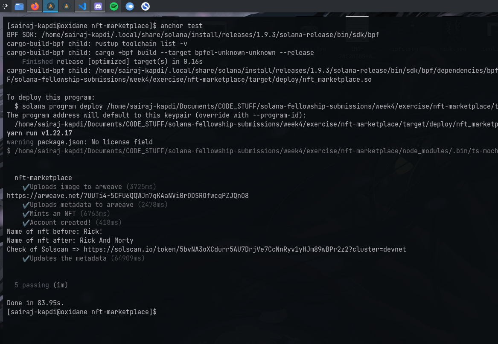

# Dynamic NFTs

## Test Results



Check out the NFT on [Solscan](https://solscan.io/token/5bvNA3oXCdurr5AU7DrjVe7CcNnRyv1yHJm89wBPr2z2?cluster=devnet)

Have written tests for minting NFTs along with changing metadata of the NFTs to acheive dynamicism. Check [here](https://github.com/SairajK19/solana-fellowship-submissions/tree/main/week4/exercise/nft-marketplace/tests)<br>
OR run

```console
$ anchor test # to run tests
```

Note: UI Still pending!
